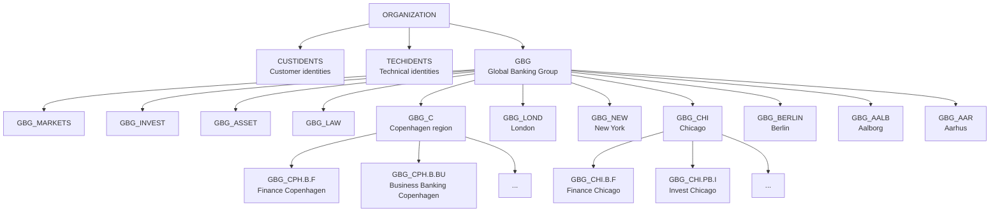
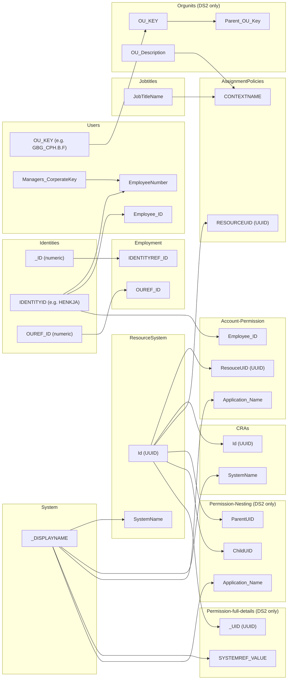
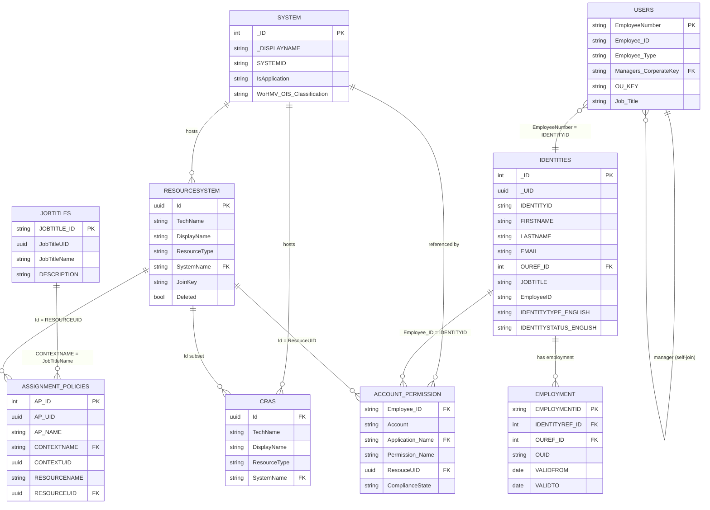
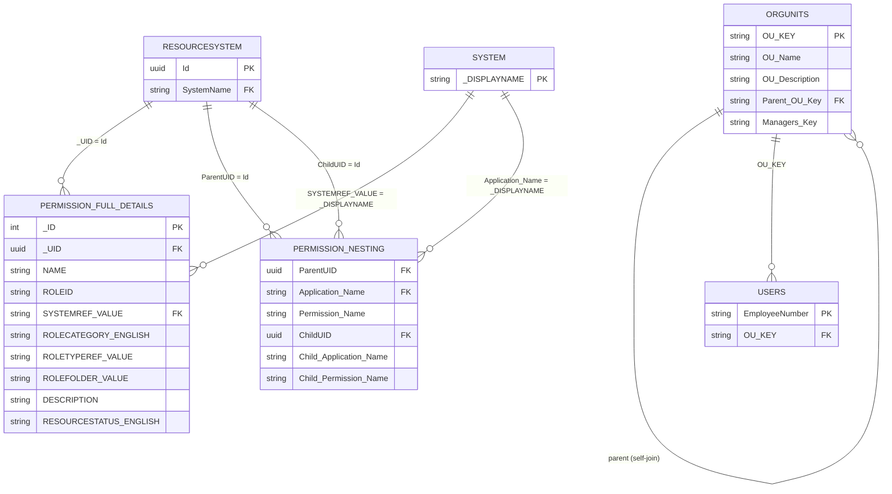
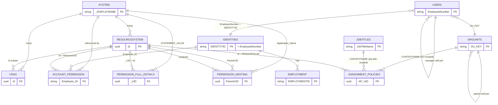

# Dataset Analysis: DatasetLed vs DatasetLed2

> This document explains the structure of both datasets, how they relate, their differences,
> and how each file maps (or doesn't) to the FortigiGraph data model.

---

## Overview

Both datasets appear to be exports from **Omada Identity** — an IGA (Identity Governance and Administration) platform used by a fictional bank called **Global Banking Group (GBG)**. The data covers a multi-country organisation with offices in Copenhagen, London, New York, Chicago, Berlin, Aalborg, Aarhus and more.

DatasetLed2 is an **extended version** of DatasetLed: same core files with minor data updates, plus three new files that add richer structural information (org unit hierarchy, permission nesting, and full permission details).

---

## Dataset 1 — DatasetLed

### Files

| File | Rows | Description |
|------|-----:|-------------|
| `System.csv` | 57 | Registry of connected target systems/applications |
| `Identities.csv` | 333 | Master identity records (humans + machine accounts) |
| `Users.csv` | 315 | User accounts with manager chain and org placement |
| `Jobtitles.csv` | 28 | Job title master list |
| `Employment.csv` | 5 | Active employment records (identity ↔ org unit links) |
| `ResourceSystem.csv` | 2,189 | Full resource/permission catalog across all systems |
| `CRAs.csv` | 37,968 | Individual resource assignments per identity |
| `Account-Permission.csv` | 6,158 | Account-level permission assignments (flattened view) |
| `AssignmentPolicies.csv` | 87 | Business role / access policy definitions |
| `EpicCompliance.csv` | 0 | Empty placeholder — no data (see notes below) |

---

### File-by-File Structure

#### `System.csv` — Target System Registry

Each row is one connected application or directory that Omada manages.

| Column | Description |
|--------|-------------|
| `_ID` | Numeric internal Omada ID |
| `_DISPLAYNAME` | Human-readable system name (e.g. "ServiceNow", "SAP ERP") |
| `SYSTEMID` | Short uppercase key (e.g. "TRADING SYSTEM") |
| `ODWBUSIKEY` | XML-encoded business key used by the Omada data warehouse |
| `SYSTEMCATEGORY_VALUE` | Category label |
| `IsApplication` | 0 = directory/infrastructure, 1 = business application |
| `WoHMV_OIS_Classification` | Risk classification: "Critical", "Non-critical", "Personal data" |

**Key relationships:** `_DISPLAYNAME` matches `SystemName` in `ResourceSystem.csv` and `CRAs.csv`.

---

#### `Identities.csv` — Master Identity Records

One row per identity in Omada. Covers both human employees and machine/technical accounts.

| Column | Description |
|--------|-------------|
| `_ID` | Numeric Omada internal ID |
| `_UID` | UUID (globally unique) |
| `IDENTITYID` | Short login code for humans (e.g. `HENKJA`), `T0001`-style for machines |
| `_DISPLAYNAME` | Full name |
| `FIRSTNAME` / `LASTNAME` | Name parts |
| `EMAIL` | Work email address |
| `OUREF_ID` | Numeric FK → org unit (maps to `Employment.OUREF_ID`) |
| `JOBTITLE` | Job title string |
| `EmployeeID` | 8-digit HR system number (e.g. `00001004`) |
| `IDENTITYSTATUS_ENGLISH` | "Active" or "Inactive" |
| `VALIDFROM` / `VALIDTO` | Active period (active = VALIDTO is year 9999) |
| `IDENTITYCATEGORY_ENGLISH` | "Employee", "Contractor", "Other" |
| `IDENTITYTYPE_ENGLISH` | "Primary" (human) or "Machine" (service account) |

**Key relationships:**
- `IDENTITYID` = `Employee_ID` in `Account-Permission.csv` = `EmployeeNumber` in `Users.csv`
- `OUREF_ID` (numeric) links to `Employment.OUREF_ID` — but note: Omada uses numeric IDs for OUs internally; the `OU_KEY` dot-notation used in `Users.csv` is a separate system key

---

#### `Users.csv` — User Accounts (Omada/AD view)

One row per provisioned user account. Slightly fewer rows than Identities (315 vs 333) because machine identities may not have a user record here.

| Column | Description |
|--------|-------------|
| `EmployeeNumber` | Same as `IDENTITYID` in Identities — the primary join key |
| `Employee_ID` | Same as `EmployeeNumber` (duplicate column) |
| `Employee_Type` | Employment category |
| `Description` | Free text |
| `Managers_CorperateKey` | `EmployeeNumber` of this person's manager → enables org chart |
| `OU_KEY` | Dot-notation org unit key (e.g. `GBG_CPH.B.F`) |
| `Employee_fullname` | Display name |
| `Job_Title` | Job title string |

**Key relationships:**
- `EmployeeNumber` → `Identities.IDENTITYID` → `Account-Permission.Employee_ID`
- `Managers_CorperateKey` → `EmployeeNumber` (self-referential manager hierarchy)
- `OU_KEY` → `Orgunits.OU_KEY` (only in Dataset 2)

---

#### `Jobtitles.csv` — Job Title Catalog

Master list of 28 job titles used in the organisation.

| Column | Description |
|--------|-------------|
| `JOBTITLE_ID` | Truncated name key (e.g. `GBG_Busine`) |
| `JobTitleUID` | UUID |
| `JobTitleName` | Full name (e.g. "Business Manager") |
| `DESCRIPTION` | Optional description |
| `JobtitleDOID` | Numeric reference |

**Key relationships:** `JobTitleName` appears in `AssignmentPolicies.CONTEXTNAME` when a policy is job-title-scoped.

---

#### `Employment.csv` — Active Employment Records

Only 5 rows in both datasets — this appears to be a **sample**, not a full export (identities have 333 rows but only 5 employment records). Represents the link between an identity and the org unit they are currently employed in.

| Column | Description |
|--------|-------------|
| `EmploymentName` | Human-readable description including name, title, location |
| `IDENTITYREF_ID` | Numeric FK → `Identities._ID` |
| `IDENTITYREF_VALUE` | Full name (denormalised) |
| `OUREF_ID` | Numeric FK → OU (internal Omada ID) |
| `OUREF_VALUE` | OU display name with key (e.g. "Finance Chicago [GBG_CHI.B.F]") |
| `OUID` | OU_KEY truncated (first 10 chars of dot-notation key) |
| `VALIDFROM` / `VALIDTO` | Employment active period |
| `EMPLOYMENTID` | Composite key: `1000_<logincode>_emp_gbg_<jobtitle>` |

---

#### `ResourceSystem.csv` — Full Permission / Resource Catalog

2,189 rows. This is the **complete catalog** of all permissions (roles, groups, app roles) across all connected systems. Think of it as the "what can be assigned" master list.

| Column | Description |
|--------|-------------|
| `Id` | UUID — primary key, used as FK in `Account-Permission.ResouceUID` |
| `TechName` / `DisplayName` | Technical and display names of the permission |
| `ResourceTypeId` | Numeric type ID |
| `ResourceType` | Type label: "SAP Role", "Okta Account", "ServiceNow Role", "Azure AD Account", etc. |
| `SystemName` | Which system this permission belongs to |
| `JoinKey` | Key used to match the resource in the target system |
| `ProvTypeAccounts` / `ProvTypeAssignments` | Provisioning mode (3 = standard) |
| `Deleted` | Soft-delete flag |

**Key relationships:**
- `Id` = `ResouceUID` in `Account-Permission.csv` (confirmed: all 72 unique UIDs in Account-Permission match)
- `ResourceSystem` IDs are a superset of `CRAs` IDs (CRAs IDs are all in ResourceSystem; ResourceSystem has 128 IDs not in CRAs)
- `SystemName` matches `System._DISPLAYNAME`

---

#### `CRAs.csv` — Current Role Assignments

37,968 rows. **CRA = Current Role Assignment** — this is the live assignment data: which permissions each identity currently holds in which system. This is the "who has what" file.

Same columns as `ResourceSystem.csv` — it is effectively a joined/denormalised view of assignments. The key difference: ResourceSystem is the catalog, CRAs is the active assignments. CRAs contains duplicates of the same permission UUID for each identity that holds it.

---

#### `Account-Permission.csv` — Flattened Permission Matrix

6,158 rows. A flattened, human-readable view of what accounts have which permissions.

| Column | Description |
|--------|-------------|
| `Employee_ID` | FK → `Identities.IDENTITYID` / `Users.EmployeeNumber` |
| `Account` | Account name in the target system (often same as Employee_ID) |
| `Application_Name` | FK → `System._DISPLAYNAME` |
| `Permission_Name` | Short permission code (e.g. `OIACCOUNT`, `TRADER_BASIC`) |
| `Role_Name` | Role label |
| `Description` | Human-readable permission description |
| `AccountType` | "Personal" or blank |
| `ResouceUID` | UUID FK → `ResourceSystem.Id` (note: typo in source — "Resouce") |
| `ComplianceState` | "Implicitly Approved" (all entries in dataset) |

---

#### `AssignmentPolicies.csv` — Business Role / Access Policy Definitions

87 rows. Defines the rules for **who should get what** — the SOLL model. Each row says "identities matching context X should receive resource Y".

| Column | Description |
|--------|-------------|
| `AP_ID` | Numeric policy ID |
| `AP_UID` | UUID |
| `NAME` | Policy name |
| `VALIDFROM` / `VALIDTO` | Active period |
| `AP_IDENTITYVIEW` | UUID of the identity view/filter this policy applies to |
| `AP_NAME` | Friendly name |
| `AP_ONLYDIRECTCTXASSN` | Direct context assignment only flag |
| `CONTEXTNAME` | Context filter: job title name or OU name (e.g. "Trader - Currency", "Finance Aalborg [GBG_AAL.B.F]") |
| `CONTEXTUID` | UUID of the context (job title or OU) |
| `RESOURCENAME` | Name of the resource/permission to assign |
| `RESOURCEUID` | UUID FK → `ResourceSystem.Id` |

**Key relationships:**
- `CONTEXTNAME` matches job titles in `Jobtitles.JobTitleName` OR org unit names from `Orgunits`
- `RESOURCEUID` → `ResourceSystem.Id`
- This file defines the **SOLL** (expected state); `Account-Permission.csv` is the **IST** (actual state)

---

#### `EpicCompliance.csv` — Empty Placeholder

Both datasets have this file with **zero data rows** (only a UTF-8 BOM, no headers, no content). This appears to be a planned export from an Epic (healthcare system) compliance module that was not populated. **Cannot be used.**

---

## Dataset 2 — DatasetLed2

### Additional Files (not in Dataset 1)

| File | Rows | Description |
|------|-----:|-------------|
| `Orgunits.csv` | 322 | Full org unit hierarchy with parent-child tree |
| `Permission-Nesting.csv` | 94 | Parent-child relationships between permissions |
| `Permission-full-details.csv` | 13,289 | Rich permission catalog with descriptions and metadata |

### Changed Files (compared to Dataset 1)

| File | DS1 Rows | DS2 Rows | Delta | Notes |
|------|---------:|---------:|------:|-------|
| `Account-Permission.csv` | 6,158 | 6,590 | +432 | Additional assignments |
| `AssignmentPolicies.csv` | 87 | 74 | −13 | Fewer policies (some removed/expired) |
| `CRAs.csv` | 37,968 | 38,403 | +435 | Additional assignments |
| `ResourceSystem.csv` | 2,189 | 2,199 | +10 | A few new resources added |

### Unchanged Files

`Employment.csv`, `EpicCompliance.csv`, `Identities.csv`, `Jobtitles.csv`, `System.csv`, `Users.csv` — identical row counts in both datasets.

---

### New File: `Orgunits.csv`

322 rows. The **complete organisational unit tree** for GBG. This was missing from Dataset 1 — only the `OU_KEY` strings in `Users.csv` hinted at the structure.

| Column | Description |
|--------|-------------|
| `OU_KEY` | Dot-notation unique key (e.g. `GBG_CPH.B.F`) — primary key |
| `OU_Description` | Display name with key appended (e.g. "Finance Copenhagen [GBG_CPH.B.F]") |
| `Managers_Key` | `OU_KEY` or `EmployeeNumber` of the OU manager |
| `Parent_OU_Key` | `OU_KEY` of parent OU → enables tree traversal |
| `OU_Name` | Short display name |

**Tree structure (top levels — 322 nodes total):**



**Key relationships:**
- `OU_KEY` = `Users.OU_KEY` (joins users to their org unit)
- `Parent_OU_Key` = self-referential hierarchy
- `OU_Description` pattern matches `Employment.OUREF_VALUE` and `AssignmentPolicies.CONTEXTNAME`

---

### New File: `Permission-Nesting.csv`

94 rows. Defines **permission inheritance / containment** — which permissions include other permissions.

| Column | Description |
|--------|-------------|
| `Application_Name` | System name of the parent permission |
| `Permission_Name` | Name of the parent permission |
| `ParentUID` | UUID of the parent permission |
| `Parent_AT` | Attribute type of parent |
| `Child_Application_Name` | System name of the child permission |
| `Child_Permission_Name` | Name of the child permission |
| `ChildUID` | UUID of child → FK to `ResourceSystem.Id` |
| `Child_AT` | Attribute type of child |

**Example:**
```
OI_ROLEFOLDEROWNER (Omada Identity) → RESOURCEOWNERS (Omada Identity)
OI_ROLEOWNER       (Omada Identity) → RESOURCEOWNERS (Omada Identity)
```

Applications with nesting defined: Anti-Fraud, Document Management, Finance System, GWG Purchasing, Knowledge Sharing, Omada Identity, Point Of Sale, Time Management, Trading System.

**Key relationships:**
- `ParentUID` / `ChildUID` → `ResourceSystem.Id`
- This is a `ResourceRelationships` structure (Contains / Grants)

---

### New File: `Permission-full-details.csv`

13,289 rows. The richest permission catalog — a **superset** of `ResourceSystem.csv` with additional metadata including descriptions, role folders, and role type classifications.

| Column | Description |
|--------|-------------|
| `_ID` | Numeric Omada internal ID |
| `_UID` | UUID — same as `ResourceSystem.Id` |
| `_DISPLAYNAME` / `NAME` | Display and technical names |
| `ROLEID` | Role code (e.g. `UNIFIED_PLUGIN_READ_ONLY`) |
| `SYSTEMREF_ID` / `SYSTEMREF_VALUE` | FK to `System._ID` / `_DISPLAYNAME` |
| `ROLECATEGORY_ENGLISH` | "Permission", "Role", "Group", "Account Type" |
| `ROLETYPEREF_ID` / `ROLETYPEREF_VALUE` | Role type (e.g. "ServiceNow Role", "SAP Role") |
| `ROLEFOLDER_ID` / `ROLEFOLDER_VALUE` | Folder grouping within the system |
| `VALIDFROM` / `VALIDTO` | Active period |
| `RESOURCESTATUS_ENGLISH` | "Active" or "Inactive" |
| `ODWBUSIKEY` / `ODWLOGICKEY` | ODW warehouse keys |
| `OBJECTGUID` | GUID from target system |
| `Resource_AT` / `Rolefolder_AT` | Attribute type codes |
| `DESCRIPTION` | Free-text description explaining what the permission does |

**Key relationships:**
- `_UID` → `ResourceSystem.Id` → `Account-Permission.ResouceUID` → `CRAs.Id`
- This file has significantly more rows (13,289) than `ResourceSystem.csv` (2,199) — it covers permissions that may be inactive or not currently assigned

---

## ID Correlation Map



---

## Data Model Diagrams

### Dataset 1 — Entity Relationship



### Dataset 2 — Additional Entities

The three new files extend the Dataset 1 model. The entities below connect into the existing diagram via `RESOURCESYSTEM`, `SYSTEM`, and `USERS`.



### Dataset 2 — Full Combined Model



---

## Fit Analysis: FortigiGraph Data Model

The FortigiGraph universal data model maps very cleanly to this Omada dataset. Below is the mapping for each source file.

### Files We Can Load — Full Confidence

| Source File | Target Table(s) | Sync Function | Notes |
|-------------|----------------|---------------|-------|
| `System.csv` | `Systems` | `Sync-FGCSVSystem` | Direct 1:1. `_DISPLAYNAME` → `displayName`, `SYSTEMID` → `systemId`, `WoHMV_OIS_Classification` → `extendedAttributes` JSON |
| `Identities.csv` | `Identities` | `Sync-FGCSVIdentity` | `IDENTITYID` → `identityId`, `_DISPLAYNAME` → `displayName`. `IDENTITYCATEGORY_ENGLISH`, `EmployeeID` → `extendedAttributes`. `OUREF_ID` resolves to `orgUnitId` via Employment |
| `Users.csv` | `Principals` | `Sync-FGCSVPrincipal` | `EmployeeNumber` → `principalId`, `Employee_Type` → `principalType`, `OU_KEY` / `Managers_CorperateKey` → `extendedAttributes`. Linked to Identities via `IdentityMembers` |
| `Jobtitles.csv` | `extendedAttributes` on `Identities` | — | Job title is a person-level attribute. Embed as `jobtitle` field on Identities, not Principals |
| `Employment.csv` | `Identities` + `OrgUnits` | — | Sets `orgUnitId` on the Identity record. `IDENTITYREF_ID` → `Identities._ID`, `OUREF_ID` → `OrgUnits` |
| `ResourceSystem.csv` | `Resources` | `Sync-FGCSVResource` | `Id` (UUID) → `resourceId`, `ResourceType` → `resourceType`, `SystemName` → link to `Systems`. `Deleted` flag useful |
| `Account-Permission.csv` | `ResourceAssignments` | `Sync-FGCSVResourceAssignment` | `Employee_ID` → `principalId`, `ResouceUID` → `resourceId`, `ComplianceState` → `assignmentStatus`. This is the IST (actual) state |
| `AssignmentPolicies.csv` | `AssignmentPolicies` | `Sync-FGCSVBusinessRole` (partial) | `AP_UID` → `policyId`, `RESOURCEUID` → `resourceId`. CONTEXTNAME maps to job title or org unit |
| `Orgunits.csv` *(DS2 only)* | `OrgUnits` | `Sync-FGOrgUnit` (or CSV variant) | `OU_KEY` → `orgUnitId`, `Parent_OU_Key` → parent FK, `OU_Description` → `displayName`. Perfect fit |
| `Permission-full-details.csv` *(DS2 only)* | `Resources` (enrich) | `Sync-FGCSVResource` | Provides `DESCRIPTION`, `ROLECATEGORY_ENGLISH`, `ROLETYPEREF_VALUE` — supplement/replace `ResourceSystem.csv` load |

### Files We Can Load — With Interpretation

| Source File | Target Table(s) | Notes |
|-------------|----------------|-------|
| `Employment.csv` | `Identities` + `OrgUnits` | Only 5 rows (sample). The `IDENTITYREF_ID` → `Identities._ID` and `OUREF_ID` → `OrgUnits` link is valid but incomplete. Sets `orgUnitId` on the Identity. Load when full export is available |
| `CRAs.csv` | `ResourceAssignments` | 37,968 rows but the structure is the **resource catalog duplicated per assignment**, not a clean assignment table. `Account-Permission.csv` is actually the better source for assignments. CRAs may contain technical/system accounts not in Account-Permission. Needs deduplication by `Id` + identity before loading |
| `Permission-Nesting.csv` *(DS2 only)* | `ResourceRelationships` | `relationshipType='Contains'` or `'GrantsAccessTo'`. `ParentUID` → `resourceId`, `ChildUID` → `relatedResourceId`. Clean fit — 94 rows |

### Files Removed from Dataset 2

| Source File | Reason |
|-------------|--------|
| `EpicCompliance.csv` | **Removed** — empty file (zero data rows, just a UTF-8 BOM). No schema to work with |
| `CRAs.csv` | **Removed** — denormalised assignment dump (38K rows, same columns as ResourceSystem). `Account-Permission.csv` is the cleaner source for assignments |

---

## What's Missing for a Complete Load

To fully use these datasets in FortigiGraph, the following gaps should be noted:

1. **Employment.csv is a sample (5 rows)** — a full export from Omada should have one employment record per active identity (~315 rows). The current 5 rows are insufficient to set `orgUnitId` on most Identities.

2. **Identities.OUREF_ID is a numeric Omada internal ID** — Dataset 2's `Orgunits.csv` uses `OU_KEY` (dot-notation), not the numeric IDs. You need either: (a) a full `Employment.csv` export (which contains `OUREF_VALUE` resolving the name), or (b) an additional Omada export that maps numeric OU IDs to `OU_KEY`.

3. **No direct Identity → Principal correlation** — the dataset has Identities (persons) and Users (accounts), but no explicit cross-system account correlation (which accounts belong to which person across systems). The `IDENTITYID` = `EmployeeNumber` link covers the primary account, but multi-system correlation requires `Invoke-FGAccountCorrelation` after loading.

4. **AssignmentPolicies.csv context resolution** — the `CONTEXTNAME` column contains either job title names or OU names (no type indicator). A reliable load requires resolving these against `Jobtitles.JobTitleName` and `Orgunits.OU_NAME` to determine whether the context is a job title or an org unit.

---

## Summary

| Aspect | Dataset 1 | Dataset 2 |
|--------|-----------|-----------|
| Core files | 10 | 11 (cleaned) |
| Loadable files | 8 of 10 | **All 11** |
| Empty/removed files | 1 (EpicCompliance) | 0 (CRAs + EpicCompliance removed) |
| Org hierarchy | Implied via OU_KEY strings | Full tree (Orgunits.csv) |
| Permission descriptions | Minimal | Rich (Permission-full-details.csv) |
| Permission nesting | Not present | 94 parent-child pairs |
| Recommended for FortigiGraph? | Yes (partial) | **Yes — prefer this one** |

**Bottom line:** Use **Dataset 2**. After removing `CRAs.csv` (redundant) and `EpicCompliance.csv` (empty), all 11 remaining files map cleanly to FortigiGraph tables: `Identities.csv` → `Identities`, `Users.csv` → `Principals`, `Jobtitles.csv` → `extendedAttributes` on Identities, `Employment.csv` → sets `orgUnitId` on Identities, and the three additional files (`Orgunits.csv`, `Permission-full-details.csv`, `Permission-Nesting.csv`) fill gaps that Dataset 1 lacks.
