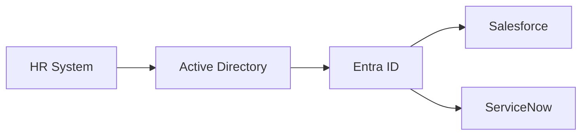

# Attribute Mapping Documentation Generator

## Overview

The **Attribute Mapping Documentation Generator** automatically creates comprehensive documentation of all attribute mappings configured in your Entra ID tenant. This helps you understand and visualize the flow of identity attributes from your HR system through Active Directory and Entra ID to your various applications.

## What Does It Document?

The generator discovers and documents:

1. **HR Provisioning to AD**
   - Workday to Active Directory
   - SuccessFactors to Active Directory
   - Custom HR sources to Active Directory

2. **Azure AD Connect Cloud Sync** (optional)
   - Active Directory to Entra ID mappings
   - Attribute transformations
   - Scoping filters

3. **SCIM Application Provisioning**
   - Entra ID to application mappings
   - All enterprise applications with SCIM enabled
   - Custom attribute mappings

## Features

- **Automatic Discovery**: Scans your entire tenant for provisioning configurations
- **Visual Diagrams**: Generates Mermaid diagrams showing attribute flow
- **Detailed Tables**: Complete attribute mapping tables for each configuration
- **Attribute Reference**: Consolidated view of all source and target attributes
- **Expression Parsing**: Shows transformation functions and expressions
- **Scoping Filters**: Documents filtering rules for each mapping
- **Multiple Formats**: Outputs to Markdown (easily convertible to HTML/PDF)

## Prerequisites

### Required Permissions

Your service principal or user account needs these Microsoft Graph API permissions:

- `Application.Read.All` - Read application configurations
- `Synchronization.Read.All` - Read synchronization configurations

### Required Entra ID Roles

One of:
- **Application Administrator**
- **Cloud Application Administrator**
- **Hybrid Identity Administrator**
- **Global Administrator**

### PowerShell Module

This feature requires FortigiGraph module version 1.2 or later:

```powershell
# Install from PowerShell Gallery
Install-Module -Name FortigiGraph -MinimumVersion 1.2

# Or import locally
Import-Module .\FortigiGraph.psd1
```

## Quick Start

### 1. Basic Usage

```powershell
# Import the module
Import-Module FortigiGraph

# Authenticate
Get-FGAccessToken -TenantId "your-tenant-id" `
                  -ClientId "your-client-id" `
                  -ClientSecret "your-client-secret"

# Generate documentation
.\Export-AttributeMappingDocumentation.ps1
```

This creates `Attribute-Mapping-Documentation.md` in the current directory.

### 2. Include Cloud Sync Configuration

```powershell
# Include Azure AD Connect Cloud Sync mappings
.\Export-AttributeMappingDocumentation.ps1 -IncludeCloudSync
```

### 3. Custom Output Path

```powershell
# Specify output location
.\Export-AttributeMappingDocumentation.ps1 `
    -OutputPath "C:\Docs\Identity\attribute-mappings.md" `
    -IncludeCloudSync
```

### 4. Include Disabled Jobs

```powershell
# Include inactive synchronization jobs
.\Export-AttributeMappingDocumentation.ps1 `
    -IncludeDisabled `
    -IncludeCloudSync
```

## Advanced Usage

### Using Individual Functions

You can also use the underlying functions directly for more granular control:

#### 1. Discover Service Principals with Sync

```powershell
# Get all apps with provisioning
$Apps = Get-FGServicePrincipalWithSync -IncludeJobs

# View summary
$Apps | Select-Object DisplayName, AppType, JobCount | Format-Table

# Example output:
# DisplayName                           AppType                    JobCount
# -----------                           -------                    --------
# Workday                              HR Provisioning (Workday)         1
# Salesforce                           SCIM Application                  1
# ServiceNow                           SCIM Application                  1
```

#### 2. Get Synchronization Jobs

```powershell
# Get jobs for a specific service principal
$Jobs = Get-FGSynchronizationJob -ServicePrincipalId "12345678-1234-1234-1234-123456789012"

# View job details
$Jobs | Select-Object id, templateId, schedule | Format-List
```

#### 3. Get Attribute Mappings

```powershell
# Get schema with attribute mappings
$Schema = Get-FGSynchronizationSchema `
    -ServicePrincipalId "12345678-1234-1234-1234-123456789012" `
    -JobId "job.1234"

# Extract attribute mappings
$Mappings = $Schema.synchronizationRules.objectMappings.attributeMappings

# View specific mappings
$Mappings | Where-Object { $_.targetAttributeName -eq "mail" } | Format-List
```

#### 4. Analyze Specific Attribute

```powershell
# Find all apps that map a specific attribute
$Apps = Get-FGServicePrincipalWithSync -IncludeSchema

foreach ($app in $Apps) {
    foreach ($schemaObj in $app.Schemas) {
        $mappings = $schemaObj.Schema.synchronizationRules.objectMappings.attributeMappings
        $mailMappings = $mappings | Where-Object { $_.targetAttributeName -eq "mail" }

        if ($mailMappings) {
            Write-Host "App: $($app.DisplayName)" -ForegroundColor Cyan
            $mailMappings | ForEach-Object {
                Write-Host "  Source: $($_.source.expression)" -ForegroundColor Yellow
            }
        }
    }
}
```

## Output Format

The generated Markdown file includes:

### 1. Overview Section
- Total count of provisioning configurations
- Breakdown by type (HR, Cloud Sync, SCIM apps)

### 2. Attribute Flow Diagram


### 3. Detailed Mappings

For each application:
- **Service principal details**
- **Synchronization rules**
- **Object mappings** (User, Group, etc.)
- **Attribute mapping tables**:

| Target Attribute | Source Expression | Flow Type | Notes |
|-----------------|-------------------|-----------|-------|
| `mail` | `[mail]` | Always | |
| `displayName` | **Function**: `Join(" ", [givenName], [surname])` | Always | |
| `department` | `[extension_..._department]` | Always | |

### 4. Attribute Reference

Consolidated tables showing:
- All target attributes and which apps write them
- All source attributes and which apps read them

## Example Output

Here's what a typical section looks like:

```markdown
### Workday

- **Type**: HR Provisioning (Workday)
- **Service Principal ID**: `12345678-1234-1234-1234-123456789012`
- **App ID**: `ec6f3f1b-2e14-4603-bcf0-0bce1c479316`
- **Active Jobs**: 1

#### Synchronization Rule: USER_INBOUND_USER

##### Object Mapping: WorkdayWorker → User

- **Direction**: HR → AD
- **Status**: ✅ Enabled
- **Flow Types**: Add, Update

| Target Attribute | Source Expression | Flow Type | Notes |
|-----------------|-------------------|-----------|-------|
| `cn` | **Function**: `Join(" ", [FirstName], [LastName])` | Always | |
| `givenName` | `[FirstName]` | Always | |
| `sn` | `[LastName]` | Always | |
| `mail` | `[Email]` | Always | |
| `employeeID` | `[WorkerID]` | Always | Matching priority: 1 |
```

## Use Cases

### 1. Documentation for Compliance
Generate documentation for audits showing how identity data flows through your systems.

```powershell
.\Export-AttributeMappingDocumentation.ps1 `
    -IncludeCloudSync `
    -OutputPath "C:\Compliance\Identity-Attribute-Mappings-$(Get-Date -Format 'yyyy-MM-dd').md"
```

### 2. Troubleshooting Attribute Issues
Quickly identify which system is responsible for populating a specific attribute.

```powershell
# Generate full documentation
.\Export-AttributeMappingDocumentation.ps1 -IncludeCloudSync

# Open in your markdown viewer
code .\Attribute-Mapping-Documentation.md

# Search for the problematic attribute (Ctrl+F)
```

### 3. Migration Planning
Document your current state before planning changes to provisioning architecture.

```powershell
.\Export-AttributeMappingDocumentation.ps1 `
    -IncludeCloudSync `
    -IncludeDisabled `
    -OutputPath ".\Before-Migration-$(Get-Date -Format 'yyyy-MM-dd').md"
```

### 4. Onboarding New Team Members
Provide comprehensive documentation of your identity infrastructure.

```powershell
# Generate comprehensive docs
.\Export-AttributeMappingDocumentation.ps1 `
    -IncludeCloudSync `
    -OutputPath ".\docs\identity-architecture.md"

# Convert to HTML/PDF if needed
```

## Understanding the Output

### Attribute Mapping Components

Each attribute mapping includes:

1. **Target Attribute**: The attribute being written to (e.g., `mail`, `displayName`)
2. **Source Expression**: Where the data comes from
   - **Direct mapping**: `[sourceAttribute]`
   - **Function**: `Join(" ", [givenName], [surname])`
   - **Constant**: `"DefaultValue"`
3. **Flow Type**: When the attribute is synchronized
   - `Always` - Updated on every sync
   - `ObjectAddOnly` - Only when creating new objects
   - `ValueAddOnly` - Only if target attribute is empty
4. **Notes**: Additional context like matching priority

### Flow Types Explained

| Flow Type | Description | Example Use Case |
|-----------|-------------|------------------|
| **Always** | Attribute synchronized on every run | Email address (should always match source) |
| **ObjectAddOnly** | Only set when creating object | Initial password, immutable ID |
| **ValueAddOnly** | Only set if target is empty | Manager (don't overwrite manual changes) |
| **AttributeAddOnly** | Only if attribute doesn't exist | Custom extension attributes |

### Expression Types

1. **Direct Attribute Mapping**
   ```
   [mail] → mail
   ```

2. **Function with Parameters**
   ```
   Join(" ", [givenName], [surname]) → displayName
   ```

3. **Conditional Logic**
   ```
   IIF([accountEnabled], "Active", "Inactive") → employeeStatus
   ```

4. **Constant Values**
   ```
   "User" → objectClass
   ```

## Troubleshooting

### No Service Principals Found

**Problem**: Script reports "No service principals with synchronization found"

**Solutions**:
1. Verify permissions: Ensure you have `Synchronization.Read.All`
2. Check authentication: Run `Confirm-FGAccessTokenValidity`
3. Verify provisioning exists: Check Azure Portal → Enterprise Applications → Provisioning
4. Include Cloud Sync: Try with `-IncludeCloudSync` parameter

### Schema Not Retrieved

**Problem**: Documentation shows "Schema details not available"

**Solutions**:
1. The script automatically includes schemas, but you can verify with:
   ```powershell
   Get-FGServicePrincipalWithSync -IncludeSchema
   ```
2. Check if synchronization job is active
3. Verify permissions include `Synchronization.Read.All`

### Slow Performance

**Problem**: Script takes a long time in large tenants

**Solutions**:
1. Filter specific apps:
   ```powershell
   $Apps = Get-FGServicePrincipalWithSync -Filter "startswith(displayName,'Workday')"
   ```
2. Skip Cloud Sync if not needed (default behavior)
3. Run during off-hours in very large tenants

### Missing Applications

**Problem**: Known SCIM app not appearing in documentation

**Solutions**:
1. Verify the app has provisioning configured (Azure Portal)
2. Ensure the provisioning job is not disabled
3. Use `-IncludeDisabled` to see inactive jobs
4. Check if the app uses a non-standard provisioning setup

## Best Practices

### 1. Regular Documentation Updates

Schedule regular documentation generation to keep it current:

```powershell
# Create a scheduled task
$Action = New-ScheduledTaskAction -Execute "pwsh.exe" `
    -Argument "-File C:\Scripts\Export-AttributeMappingDocumentation.ps1 -OutputPath C:\Docs\attribute-mappings-$(Get-Date -Format 'yyyy-MM-dd').md"

$Trigger = New-ScheduledTaskTrigger -Weekly -DaysOfWeek Monday -At 9am

Register-ScheduledTask -TaskName "Generate Attribute Mapping Docs" `
    -Action $Action -Trigger $Trigger
```

### 2. Version Control

Store documentation in version control to track changes:

```powershell
# Generate with dated filename
$Date = Get-Date -Format 'yyyy-MM-dd'
.\Export-AttributeMappingDocumentation.ps1 `
    -OutputPath ".\docs\attribute-mappings-$Date.md"

# Commit to git
git add ".\docs\attribute-mappings-$Date.md"
git commit -m "Update attribute mapping documentation - $Date"
git push
```

### 3. Compare Changes

Compare documentation over time to identify changes:

```powershell
# Generate current state
.\Export-AttributeMappingDocumentation.ps1 -OutputPath ".\current.md"

# Compare with previous version
code --diff .\previous.md .\current.md
```

### 4. Combine with Other Documentation

Integrate with your broader identity documentation:

```powershell
# Generate multiple documents
.\Export-AttributeMappingDocumentation.ps1 -OutputPath ".\docs\02-attribute-mappings.md"

# Create comprehensive documentation structure:
# .\docs\
#   01-architecture-overview.md
#   02-attribute-mappings.md (generated)
#   03-security-configuration.md
#   04-troubleshooting-guide.md
```

## API Reference

### New Functions

#### Get-FGSynchronizationJob

Gets synchronization jobs for a service principal.

```powershell
Get-FGSynchronizationJob -ServicePrincipalId "..." [-JobId "..."]
```

**Parameters**:
- `ServicePrincipalId` - Service principal object ID (required)
- `JobId` - Specific job ID (optional)

**Returns**: Synchronization job object(s) with id, templateId, schedule, and status

#### Get-FGSynchronizationSchema

Gets the synchronization schema containing attribute mappings.

```powershell
Get-FGSynchronizationSchema -ServicePrincipalId "..." -JobId "..."
# OR
Get-FGSynchronizationSchema -ServicePrincipalId "..." -TemplateId "..."
```

**Parameters**:
- `ServicePrincipalId` - Service principal object ID (required)
- `JobId` - Job ID (for configured jobs)
- `TemplateId` - Template ID (for default templates)

**Returns**: Schema object with synchronizationRules, objectMappings, and attributeMappings

#### Get-FGServicePrincipalWithSync

Discovers all service principals with synchronization configured.

```powershell
Get-FGServicePrincipalWithSync [-IncludeCloudSync] [-IncludeJobs] [-IncludeSchema] [-Filter "..."]
```

**Parameters**:
- `IncludeCloudSync` - Include Azure AD Connect Cloud Sync
- `IncludeJobs` - Include job details in output
- `IncludeSchema` - Include complete schemas (slower)
- `Filter` - Filter service principals by display name

**Returns**: Array of objects with DisplayName, AppType, ServicePrincipalId, JobCount, and optional Jobs/Schemas

## Related Resources

### Microsoft Documentation

- [Azure AD synchronization API overview](https://learn.microsoft.com/en-us/graph/api/resources/synchronization-overview)
- [Attribute mapping in Azure AD](https://learn.microsoft.com/en-us/entra/identity/app-provisioning/customize-application-attributes)
- [Understanding Cloud Sync](https://learn.microsoft.com/en-us/entra/identity/hybrid/cloud-sync/what-is-cloud-sync)
- [SCIM provisioning with Graph API](https://learn.microsoft.com/en-us/entra/identity/app-provisioning/application-provisioning-configuration-api)

### FortigiGraph Resources

- [GitHub Repository](https://github.com/Fortigi/FortigiGraph)
- [PowerShell Gallery](https://www.powershellgallery.com/packages/FortigiGraph)
- [Module Documentation](../README.md)

## Support

For issues or questions:

1. Check the [troubleshooting section](#troubleshooting) above
2. Review [FortigiGraph documentation](../README.md)
3. Open an issue on [GitHub](https://github.com/Fortigi/FortigiGraph/issues)

## Contributing

Contributions are welcome! Please:

1. Fork the repository
2. Create a feature branch
3. Make your changes following the [development guide](../CLAUDE.md)
4. Submit a pull request

## License

This feature is part of the FortigiGraph module.

---

**Author**: Wim van den Heijkant
**Company**: Fortigi
**Version**: 1.0
**Last Updated**: 2026-01-13
