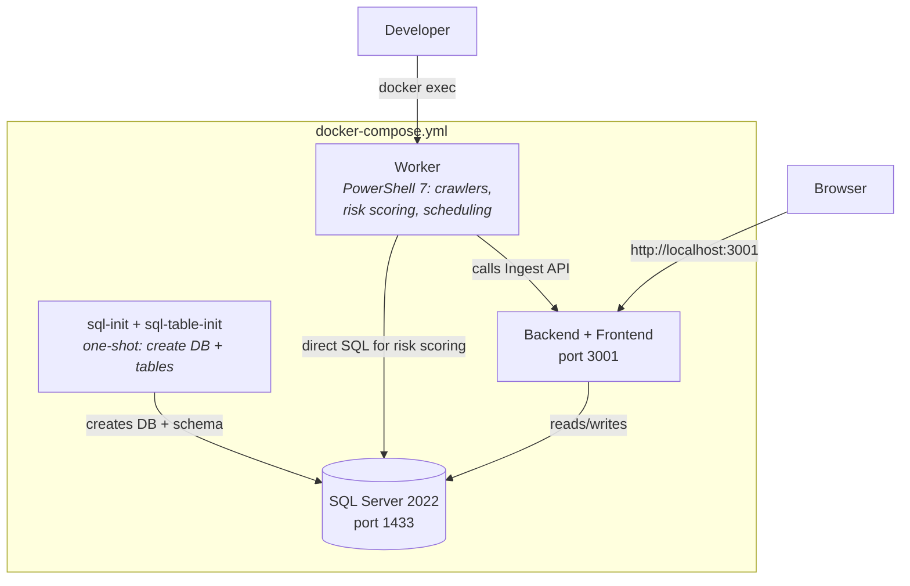

# Docker Setup

Running Identity Atlas locally with Docker — three containers providing the full stack.

---

## Quick Start (End Users — No Git Required)

The fastest way to try Identity Atlas — pulls pre-built images, no source code needed:

```bash
# Download the production compose file
curl -O https://raw.githubusercontent.com/Fortigi/FortigiGraph/main/docker-compose.prod.yml

# Start everything (first run: ~2 min to pull images)
docker compose -f docker-compose.prod.yml up -d

# Open the UI
open http://localhost:3001
```

On first visit, the UI auto-navigates to the **Crawlers** page with a getting-started card. Click **"Load Demo Data"** to populate the system with synthetic data (~30 seconds). After that, explore the Matrix, Users, Resources, and other pages.

To connect your own Entra ID tenant, click **"Connect Entra ID"** on the Crawlers page and enter your App Registration credentials (Tenant ID, Client ID, Client Secret).

---

## Developer Setup (From Source)

For contributors who want to build and modify the code locally.

## Architecture



## Services

| Service | Image | Ports | Purpose |
|---|---|---|---|
| `sql` | SQL Server 2022 | 1433 | Database with temporal tables |
| `sql-init` | SQL Server 2022 (one-shot) | — | Creates `GraphData` database |
| `sql-table-init` | PowerShell 7 (one-shot) | — | Creates all application tables, views, indexes |
| `web` | Node.js 20 | 3001 | Ingest API + Read API + served React frontend |
| `worker` | PowerShell 7 | — | Crawlers, risk scoring, account correlation, scheduling |

After startup, 3 containers remain running: `sql`, `web`, `worker`.

---

## Quick Start (Developer)

```powershell
cd c:\Source\GitHub\FortigiGraph

# Start the stack (first time takes ~3 min to build)
docker compose up -d --build

# Verify
docker compose ps
# Expected: sql (healthy), web (up), worker (up)

# Open the UI — click "Load Demo Data" on the Crawlers page
Start-Process http://localhost:3001

# Open Swagger docs
Start-Process http://localhost:3001/api/docs
```

## Stopping

```powershell
# Stop (keep data)
docker compose -f docker-compose.yml down

# Stop and delete all data
docker compose -f docker-compose.yml down -v
```

---

## Auto-Bootstrap

On first startup, the backend automatically:

1. Creates a **WorkerConfig** table (key-value store for worker settings)
2. Creates a **CrawlerJobs** table (SQL-based job queue between UI and worker)
3. Creates a **Built-in Worker** crawler with a generated API key
4. Stores the API key in WorkerConfig for the worker to discover

The worker discovers the key on startup by polling WorkerConfig (retries for up to 2 minutes while the backend initializes). This means no manual crawler registration is needed — jobs submitted from the UI are automatically picked up and executed by the worker.

## Job Queue

The UI can submit crawler jobs (demo data, Entra ID sync, CSV import) via `POST /api/admin/crawler-jobs`. Jobs are stored in the `CrawlerJobs` SQL table and picked up by the worker every 30 seconds.

The `Invoke-CrawlerJob.ps1` dispatcher routes jobs to the appropriate crawler script:

| Job Type | Dispatcher target |
|---|---|
| `demo` | `Ingest-DemoDataset.ps1` (synthetic data, baked into image) |
| `entra-id` | `Start-EntraIDCrawler.ps1` (fetches from Microsoft Graph) |
| `csv` | `Start-CSVCrawler.ps1` (reads uploaded CSV files) |

Progress is updated in SQL during execution and displayed in the UI with a progress bar.

## Crawler Configuration

Crawler configs are stored persistently in `dbo.CrawlerConfigs` and managed through the UI wizard. Each config stores:

- **Credentials** (Tenant ID, Client ID, Client Secret — secret is write-only, never readable via API)
- **Object types** to sync (Identity, Context, Users & Groups, Governance, Apps, Directory Roles, PIM)
- **Custom attributes** — additional user/group attributes to fetch from Graph (e.g., `employeeHireDate`, `extension_*`)
- **Identity filter** — selects which users are treated as identities (e.g., `employeeId` is not null)
- **Schedule** — hourly/daily/weekly with configurable time

### Custom Attributes

Extra attributes are appended to the Graph API `$select` clause and stored in the `extendedAttributes` JSON column:

```
User attributes:  employeeHireDate, onPremisesSyncEnabled, employeeType, extension_abc_costCenter
Group attributes: classification, resourceBehaviorOptions
```

### Identity Filter

Controls which users get synced as identities (useful for HR-managed account detection):

| Condition | Example |
|---|---|
| `isNotNull` | Users where `employeeId` has a value |
| `equals` | Users where `employeeType` equals `"Employee"` |
| `notEquals` | Users where `accountEnabled` is not `false` |
| `inValues` | Users where `companyName` is in `["Contoso", "Fabrikam"]` |

### Scheduling

Crawlers can be scheduled directly from the UI. The worker checks `CrawlerConfigs` every minute and queues jobs at the configured time.

| Frequency | Description |
|---|---|
| `hourly` | Runs at `:MM` every hour |
| `daily` | Runs at `HH:MM UTC` every day |
| `weekly` | Runs at `HH:MM UTC` on a specific day |

Scheduled jobs appear in the "Recent Jobs" table like any other job.

---

## Worker Container

The worker container runs PowerShell 7 with the Identity Atlas module pre-loaded. It has three responsibilities:

1. **Job queue polling** — picks up queued jobs from CrawlerJobs every 30 seconds
2. **Scheduled crawlers** — reads CrawlerConfigs schedules every minute and queues jobs at the right time
3. **Legacy crontab** — reads `setup/docker/crontab` for manually configured jobs (risk scoring, account correlation)

### Run Ad-Hoc Commands

```powershell
# Open an interactive PowerShell session in the worker
docker exec -it fortigigraph-worker-1 pwsh

# Run a one-off command
docker exec fortigigraph-worker-1 pwsh -Command "Import-Module /app/setup/IdentityAtlas.psd1; Get-Command *FG*"
```

### Legacy Crontab (for non-crawler jobs)

Edit `setup/docker/crontab` for jobs that aren't configured via the UI (risk scoring, account correlation):

```cron
# Risk scoring nightly at 03:00
0 3 * * * /usr/bin/pwsh -Command "Import-Module /app/setup/IdentityAtlas.psd1; Invoke-FGRiskScoring"
```

```powershell
docker compose -f docker-compose.yml restart worker
```

### Environment Variables

Create `.env` from the template for secrets:

```powershell
cp setup/config/.env.example .env
# Edit .env with your values
```

| Variable | Purpose |
|---|---|
| `SQL_PASSWORD` | SQL Server SA password |
| `CRAWLER_API_KEY` | API key for the worker's crawler |
| `GRAPH_TENANT_ID` / `CLIENT_ID` / `CLIENT_SECRET` | For EntraID crawler |
| `LLM_PROVIDER` / `LLM_API_KEY` | For risk scoring (Anthropic or OpenAI) |

---

## Folder Mapping

| Host Path | Container Path | Used By |
|---|---|---|
| `app/api/src/` | `/app/backend/src/` | web |
| `app/ui/` (built) | `/app/frontend/dist/` | web (static) |
| `app/db/` | `/app/app/db/` | sql-table-init, worker |
| `tools/` | `/app/tools/` | worker |
| `setup/docker/crontab` | `/app/setup/docker/crontab` | worker |
| `job_data` (named volume) | `/data/uploads/` | web (writes), worker (reads) — CSV crawler uploads |

---

## Rebuilding

After code changes:

```powershell
# Rebuild only the web service (API + UI changes)
docker compose -f docker-compose.yml up -d --build web

# Rebuild the worker (PowerShell script changes)
docker compose -f docker-compose.yml up -d --build worker

# Rebuild everything from scratch
docker compose -f docker-compose.yml down -v
docker compose -f docker-compose.yml up -d --build
```
