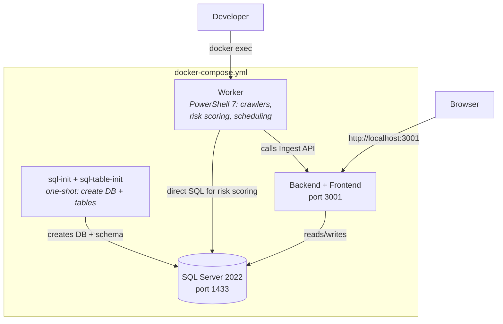

# Docker Setup

Running FortigiGraph locally with Docker — three containers providing the full stack.

---

## Architecture



## Services

| Service | Image | Ports | Purpose |
|---|---|---|---|
| `sql` | SQL Server 2022 | 1433 | Database with temporal tables |
| `sql-init` | SQL Server 2022 (one-shot) | — | Creates `GraphData` database |
| `sql-table-init` | PowerShell 7 (one-shot) | — | Creates all application tables, views, indexes |
| `backend` | Node.js 20 | 3001 | Ingest API + Read API + served React frontend |
| `worker` | PowerShell 7 | — | Crawlers, risk scoring, account correlation, scheduling |

After startup, 3 containers remain running: `sql`, `backend`, `worker`.

---

## Quick Start

```powershell
cd c:\Source\GitHub\FortigiGraph

# Start the stack (first time takes ~3 min to build)
docker compose -f docker-compose.yml up -d --build

# Verify
docker compose -f docker-compose.yml ps
# Expected: sql (healthy), backend (up), worker (up)

# Load demo data
.\setup\local-sync.ps1

# Open the UI
Start-Process http://localhost:3001

# Open Swagger docs
Start-Process http://localhost:3001/api/docs
```

## Stopping

```powershell
# Stop (keep data)
docker compose -f docker-compose.yml down

# Stop and delete all data
docker compose -f docker-compose.yml down -v
```

---

## Worker Container

The worker container runs PowerShell 7 with the FortigiGraph module pre-loaded. It reads `setup/docker/crontab` for scheduled jobs.

### Run Ad-Hoc Commands

```powershell
# Open an interactive PowerShell session in the worker
docker exec -it fortigigraph-worker-1 pwsh

# Run a one-off command
docker exec fortigigraph-worker-1 pwsh -Command "Import-Module /app/FortigiGraph.psd1; Get-Command *FG*"
```

### Configure Scheduled Jobs

Edit `setup/docker/crontab` and restart the worker:

```cron
# Risk scoring nightly at 03:00
0 3 * * * /usr/bin/pwsh -Command "Import-Module /app/FortigiGraph.psd1; Invoke-FGRiskScoring"

# CSV crawler nightly at 02:00
0 2 * * * /usr/bin/pwsh -File /app/tools/crawlers/csv/Start-CSVCrawler.ps1 -ApiBaseUrl http://backend:3001/api -ApiKey $CRAWLER_API_KEY -CsvFolder /data/csv
```

```powershell
docker compose -f docker-compose.yml restart worker
```

### Environment Variables

Create `.env` from the template for secrets:

```powershell
cp setup/config/.env.example .env
# Edit .env with your values
```

| Variable | Purpose |
|---|---|
| `SQL_PASSWORD` | SQL Server SA password |
| `CRAWLER_API_KEY` | API key for the worker's crawler |
| `GRAPH_TENANT_ID` / `CLIENT_ID` / `CLIENT_SECRET` | For EntraID crawler |
| `LLM_PROVIDER` / `LLM_API_KEY` | For risk scoring (Anthropic or OpenAI) |
| `CSV_DATA_PATH` | Host path to CSV files mounted into worker |

---

## Folder Mapping

| Host Path | Container Path | Used By |
|---|---|---|
| `app/api/src/` | `/app/backend/src/` | backend |
| `app/ui/` (built) | `/app/frontend/dist/` | backend (static) |
| `app/db/` | `/app/app/db/` | sql-table-init, worker |
| `tools/` | `/app/tools/` | worker |
| `setup/docker/crontab` | `/app/setup/docker/crontab` | worker |
| `test/datasets/DatasetLed2/` | `/data/csv/` | worker (mounted volume) |

---

## Rebuilding

After code changes:

```powershell
# Rebuild only the backend (API + UI changes)
docker compose -f docker-compose.yml up -d --build backend

# Rebuild the worker (PowerShell script changes)
docker compose -f docker-compose.yml up -d --build worker

# Rebuild everything from scratch
docker compose -f docker-compose.yml down -v
docker compose -f docker-compose.yml up -d --build
```
