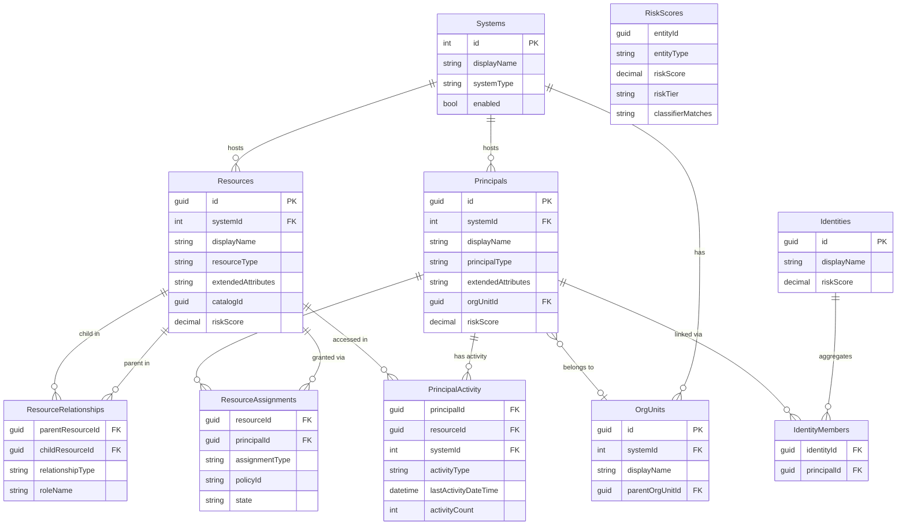

# Data Model

FortigiGraph uses a unified data model (v3.1) that stores all authorization entities — from any source system — in a consistent structure backed by SQL Server temporal tables.

---

## Core Design Principles

Four principles drive the data model design:

**Universal**
Any authorization source maps to the same tables. Entra ID groups, SAP roles, Omada business roles, and custom CSV imports all become `Resources` and `Principals` in the same schema. No source-specific tables.

**Temporal**
All core tables are SQL Server temporal tables. Every insert, update, and delete is automatically versioned with a system-maintained history table. Point-in-time queries are available for any entity at any date.

**Core + JSON**
Frequently queried attributes (`displayName`, `resourceType`, `department`) are real SQL columns with indexes. System-specific fields that vary by source live in an `extendedAttributes` NVARCHAR(MAX) JSON column. This gives you index performance on hot paths without a rigid, source-specific schema.

**Unified business roles**
Business roles are not stored in a separate table. They are `Resources` with `resourceType = 'BusinessRole'`. Their assignments are `ResourceAssignments` with `assignmentType = 'Governed'`. Their resource grants are `ResourceRelationships` with `relationshipType = 'Contains'`. The result is a single set of views, risk scores, and queries that apply to all resource types equally.

---

## Entity Relationship Diagram

---

## Table Reference

### Systems

Represents a connected authorization source. Every resource and principal is owned by exactly one system.

| Property | Value |
|---|---|
| Primary Key | `id` INT IDENTITY |
| Temporal | Yes |
| Created by | `Initialize-FGSystemTables` |

Key columns: `displayName`, `systemType` (e.g. `EntraID`, `Omada`, `SAP`, `CSV`), `enabled`.

---

### Resources

Any permission-granting entity: Entra ID groups, directory roles, application roles, business roles, SharePoint sites, Azure RBAC roles, or any custom type. The `resourceType` column discriminates between them.

| Property | Value |
|---|---|
| Primary Key | `id` GUID |
| Temporal | Yes |
| Created by | `Initialize-FGSystemTables` |

Key columns: `displayName`, `resourceType`, `systemId`, `extendedAttributes` (JSON), `catalogId`, `isHidden`, `riskScore`.

---

### ResourceAssignments

Captures who has access to what, and how. The `assignmentType` column distinguishes direct membership from PIM-eligible access from governed (business-role-driven) access.

| Property | Value |
|---|---|
| Primary Key | Composite: `resourceId` + `principalId` + `assignmentType` |
| Temporal | Yes |
| Created by | `Initialize-FGSystemTables` |

Key columns: `assignmentType`, `policyId`, `state`, `assignmentStatus`, `expirationDateTime`.

---

### ResourceRelationships

Resource-to-resource links. Used for two purposes: `Contains` links a business role to the resources it grants; `GrantsAccessTo` expresses that holding one resource implies access to another.

| Property | Value |
|---|---|
| Primary Key | Composite: `parentResourceId` + `childResourceId` + `relationshipType` |
| Temporal | Yes |
| Created by | `Initialize-FGSystemTables` |

Key columns: `relationshipType`, `roleName`, `roleOriginSystem`.

---

### Principals

All identity types from any system. The `principalType` column distinguishes human accounts from service principals, managed identities, AI agents, and more.

| Property | Value |
|---|---|
| Primary Key | `id` GUID |
| Temporal | Yes |
| Created by | `Initialize-FGSystemTables` |

Key columns: `displayName`, `principalType`, `systemId`, `orgUnitId`, `extendedAttributes` (JSON), `riskScore`.

---

### PrincipalActivity

High-frequency activity signals: sign-ins, per-app usage, AI agent invocations. This table is intentionally **not** temporal. See [Activity Data](#activity-data-principalactivity) below for the reason.

| Property | Value |
|---|---|
| Primary Key | Composite: `principalId` + `resourceId` + `systemId` + `activityType` |
| Temporal | No (upsert-based) |
| Created by | `Initialize-FGSystemTables` |

Key columns: `activityType`, `lastActivityDateTime`, `activityCount`.

---

### OrgUnits

Organizational units such as departments or teams. Can be derived from `department` attributes in Principals (via `Sync-FGOrgUnit`) or loaded from an HR system via CSV.

| Property | Value |
|---|---|
| Primary Key | `id` GUID |
| Temporal | Yes |
| Created by | `Initialize-FGSystemTables` |

Key columns: `displayName`, `systemId`, `parentOrgUnitId` (self-referencing for hierarchy).

---

### Identities

Real persons aggregated across multiple accounts and source systems. An identity is the result of account correlation: one human may have an Entra ID user, a service account, and a privileged admin account — all linked to one Identity record.

| Property | Value |
|---|---|
| Primary Key | `id` GUID |
| Temporal | Yes |
| Created by | `Initialize-FGSystemTables` |

Key columns: `displayName`, `riskScore`.

---

### IdentityMembers

The join table between Identities and Principals. One identity links to one or more principals, potentially across different source systems.

| Property | Value |
|---|---|
| Primary Key | Composite: `identityId` + `principalId` |
| Temporal | Yes |
| Created by | `Initialize-FGSystemTables` |

---

### RiskScores

Risk assessment results for any entity type (Principal, Resource, Identity, OrgUnit). Written by `Invoke-FGRiskScoring` and updated by analyst overrides.

| Property | Value |
|---|---|
| Primary Key | Composite: `entityId` + `entityType` |
| Temporal | Yes |
| Created by | `Initialize-FGRiskScoreTables` |

Key columns: `riskScore`, `riskTier`, `classifierMatches` (JSON), `analystOverride`, `overrideReason`.

---

## principalType Values

The `principalType` column on the Principals table uses these standard values across all sync and scoring functions.

| Value | What it covers | Source |
|---|---|---|
| `User` | Interactive human user accounts | `Sync-FGPrincipal`, CSV |
| `ServicePrincipal` | App registration service principals | `Sync-FGServicePrincipal` |
| `ManagedIdentity` | Azure resource-attached identities (system or user-assigned) | `Sync-FGServicePrincipal` |
| `WorkloadIdentity` | Federated credential identities (GitHub Actions, AKS workloads) | `Sync-FGServicePrincipal`, CSV |
| `AIAgent` | AI agents: Copilot Studio, Azure OpenAI, custom bots | `Sync-FGServicePrincipal` auto-detection, CSV |
| `ExternalUser` | Guest / B2B accounts from another tenant | CSV import |
| `SharedMailbox` | Shared mailboxes and room/equipment accounts | CSV import |

!!! note "Risk scoring behavior by principalType"
    `User` principals receive the full set of stale sign-in, never-signed-in, and guest-account checks. Non-human types (`ServicePrincipal`, `ManagedIdentity`, `WorkloadIdentity`, `AIAgent`) receive structural signals only — no stale sign-in checks. All types participate in direct classifier matching, membership analysis, and risk propagation.

---

## resourceType Values

The `resourceType` column on the Resources table is a free-form string. These are the standard values used by the built-in sync functions.

| Value | What it covers |
|---|---|
| `EntraGroup` | Entra ID security groups and Microsoft 365 groups |
| `EntraDirectoryRole` | Entra ID directory roles (Global Administrator, etc.) |
| `EntraAppRole` | Application roles from enterprise app registrations |
| `BusinessRole` | Named entitlement bundles from any IGA platform |
| `SharePointSite` | SharePoint sites (via CSV import) |
| `AzureRBACRole` | Azure RBAC role assignments (via CSV import) |
| Custom | Any string — fully extensible for any authorization source |

!!! tip "Extending resourceType"
    You can use any string value for custom source systems. The model does not enforce an enum — `resourceType` is NVARCHAR(100). Use a consistent naming convention such as `SystemPrefix_TypeName` (e.g., `SAP_Role`, `Pathlock_Permission`) so queries and views remain readable.

---

## assignmentType Values

The `assignmentType` column on ResourceAssignments describes how the assignment was created and what it means.

| Value | Meaning |
|---|---|
| `Direct` | Direct group membership |
| `Owner` | Group owner relationship |
| `Eligible` | PIM-eligible membership — granted but not yet activated |
| `Governed` | Assigned through a business role or access package |
| Custom | Any string for CSV-imported assignments |

---

## Source System Mapping

The same three tables (Resources, Principals, ResourceAssignments) absorb data from any source. The sync function and the `resourceType` / `assignmentType` values are the only things that differ.

| Source System | Sync Method | resourceType | principalType | assignmentType |
|---|---|---|---|---|
| Entra ID groups | `Sync-FGGroup` | `EntraGroup` | `User` | `Direct` / `Owner` / `Eligible` |
| Entra ID directory roles | `Sync-FGEntraDirectoryRole` | `EntraDirectoryRole` | `User` | `Direct` |
| Entra ID app roles | `Sync-FGEntraAppRoleAssignment` | `EntraAppRole` | `User` / `ServicePrincipal` | `Direct` |
| Entra ID access packages | `Sync-FGAccessPackage` | `BusinessRole` | — | `Governed` (via assignments sync) |
| Omada / SailPoint | CSV import via `Sync-FGCSVBusinessRole` | `BusinessRole` | Any | `Governed` |
| SAP / Pathlock | CSV import via `Sync-FGCSVResource` | Any | Any | Any |
| Custom system | `Sync-FGCSVResource` + `Sync-FGCSVResourceAssignment` | Any | Any | Any |

---

## Activity Data (PrincipalActivity)

PrincipalActivity is physically separated from Principals by design, even though it describes the same entities.

**Why not store activity in Principals?**

Principals is a temporal table. SQL Server temporal tables record a new history row every time any column value changes. Sign-in timestamps change daily — sometimes hourly — for active accounts. Storing `lastSignInDateTime` on Principals would generate enormous version history for data that is not meaningful to audit. A user's last sign-in two minutes ago is not a material change that anyone needs to review.

**What PrincipalActivity does instead:**

Each row stores the latest known activity per `(principalId, resourceId, systemId, activityType)` combination. Sync functions upsert into this table, overwriting the previous value in place. No history is retained — the table is always a current snapshot.

**Activity types:**

| activityType | Source | Meaning |
|---|---|---|
| `SignIn` | Entra ID audit log | Most recent interactive or non-interactive sign-in |
| `AppSignIn` | Entra ID audit log | Last sign-in to a specific application (resourceId = app) |
| `Invocation` | AI platform telemetry | Last invocation of an AI agent |

**Use in risk scoring:**

The risk engine queries PrincipalActivity to detect:

- **Stale accounts** — `User` principals with no `SignIn` activity in 90+ days
- **Ghost app roles** — `EntraAppRole` assignments where the user has never signed in to the app
- **Active high-privilege usage** — principals actively using sensitive resources (reduces risk score)
- **AI agent dormancy** — `AIAgent` principals with no recent `Invocation` activity
