# Syncing from Entra ID

FortigiGraph provides deep integration with Microsoft Entra ID (Azure AD). A single orchestrator command syncs all identity and governance data into Azure SQL, or you can run individual sync functions to target specific entity types.

---

## Orchestrated Sync

The recommended way to run a full sync is through the `Start-FGSync` orchestrator:

```powershell
Start-FGSync -ConfigFile '.\Config\mycompany.json'
```

`Start-FGSync` handles the entire sync lifecycle:

- **Fresh authentication** — acquires a new Graph API token at the start of every run, so stale tokens from previous sessions never cause failures
- **SQL connection and firewall** — connects to Azure SQL and adds the current IP to the firewall if needed
- **Parallel execution** — runs up to 6 entity types concurrently via a runspace pool
- **Schema evolution** — creates tables, adds missing columns, and builds indexes automatically
- **View creation** — creates or refreshes all analytical SQL views after data sync completes
- **Summary report** — prints a table of what was synced and how long each step took

### Optional flags

| Flag | Default | Purpose |
|------|---------|---------|
| `-SyncServicePrincipals $true` | Off | Sync managed identities, AI agents, and service principals |
| `-SyncPrincipalActivity $true` | Off | Populate PrincipalActivity table from sign-in data |
| `-SyncAppRoleActivity $true` | Off | Sync per-app sign-in events from the audit log (last 30 days) |
| `-ParallelExecution $false` | On | Disable parallel execution for sequential debugging |
| `-UserFilter "accountEnabled eq true"` | All enabled | OData filter applied to user sync |
| `-UserAdditionalAttributes @(...)` | Standard columns | Extra Graph attributes to capture |
| `-SkipServerValidation` | Off | Skip SQL Server existence check (speeds up repeat runs) |

!!! tip
    All flags can also be set in the config file under the `Sync` section, so you do not need to pass them every time. Command-line flags always override the config file.

---

## What Gets Synced

```mermaid
flowchart TD
    EntraID[Entra ID] --> U[Users → Principals]
    EntraID --> SP[Service Principals → Principals]
    EntraID --> G[Groups → Resources]
    EntraID --> DR[Directory Roles → Resources]
    EntraID --> AR[App Roles → Resources]
    EntraID --> GM[Group Members → ResourceAssignments\nDirect]
    EntraID --> GE[PIM Eligible → ResourceAssignments\nEligible]
    EntraID --> GO[Group Owners → ResourceAssignments\nOwner]
    EntraID --> CAT[Catalogs → GovernanceCatalogs]
    EntraID --> AP[Access Packages → Resources\nresourceType=BusinessRole]
    EntraID --> APA[AP Assignments → ResourceAssignments\nassignmentType=Governed]
    EntraID --> APR[AP Resource Scopes → ResourceRelationships\nrelationshipType=Contains]
    EntraID --> APP[AP Policies → AssignmentPolicies]
    EntraID --> APQ[AP Requests → AssignmentRequests]
    EntraID --> APV[AP Reviews → CertificationDecisions]
    EntraID --> PA[Sign-in Activity → PrincipalActivity]
```



---

## Individual Sync Commands

You can run any sync function individually. This is useful for incremental refreshes, troubleshooting, or building custom orchestration scripts.

### Principals

Sync human user accounts from Entra ID:

```powershell
# Standard sync — maps core attributes to dedicated columns
Sync-FGPrincipal

# Add extra Graph attributes — new columns are created automatically
Sync-FGPrincipal -AdditionalAttributes @('extensionAttribute1', 'officeLocation', 'employeeType')
```

Sync non-human identities (off by default in `Start-FGSync`):

```powershell
# All enabled service principals, managed identities, and AI agents
Sync-FGServicePrincipal

# Skip built-in Microsoft first-party service principals
Sync-FGServicePrincipal -ExcludeFirstPartyMicrosoft

# Add custom AI agent detection patterns (regex applied to displayName)
Sync-FGServicePrincipal -AINamePatterns @('(?i)mycompany.*bot', '(?i).*-agent$')
```

`Sync-FGServicePrincipal` automatically classifies each principal into one of:
`ServicePrincipal`, `ManagedIdentity`, `WorkloadIdentity`, or `AIAgent`.
See [principalType conventions](../concepts/data-model.md) for the full detection rules.

### Resources

```powershell
# Groups → Resources (resourceType = 'EntraGroup')
Sync-FGGroup

# Directory roles → Resources (resourceType = 'EntraDirectoryRole')
Sync-FGEntraDirectoryRole

# App role assignments → Resources (resourceType = 'EntraAppRole') + ResourceAssignments
Sync-FGEntraAppRoleAssignment
```

### Memberships

```powershell
# Direct group members → ResourceAssignments (assignmentType = 'Direct')
Sync-FGGroupMember

# PIM eligible members → ResourceAssignments (assignmentType = 'Eligible')
Sync-FGGroupEligibleMember

# Group owners → ResourceAssignments (assignmentType = 'Owner')
Sync-FGGroupOwner
```

### Relationships and Org Structure

```powershell
# Resource-to-resource nesting and grants → ResourceRelationships
Sync-FGResourceRelationship

# Calculate Contexts from department/org data in Identities
Sync-FGContext
```

### Governance

Sync the full Entra ID entitlement management model:

```powershell
# Catalogs → GovernanceCatalogs
Sync-FGCatalog

# Access packages → Resources (resourceType = 'BusinessRole')
Sync-FGAccessPackage

# AP assignments → ResourceAssignments (assignmentType = 'Governed')
Sync-FGAccessPackageAssignment

# AP resource role scopes → ResourceRelationships (relationshipType = 'Contains')
Sync-FGAccessPackageResourceRoleScope

# Assignment policies → AssignmentPolicies
Sync-FGAccessPackageAssignmentPolicy

# Assignment requests → AssignmentRequests
Sync-FGAccessPackageAssignmentRequest

# Access reviews → CertificationDecisions
Sync-FGAccessPackageAccessReview
```

### Activity Data

```powershell
# Migrate lastSignIn from Principals.extendedAttributes → PrincipalActivity (no Graph call)
Sync-FGPrincipalActivity

# Fetch fresh sign-in data directly from Graph API
Sync-FGPrincipalActivity -FetchFromGraph

# Per-app sign-in events from the audit log (last 30 days) → AppRoleActivity
Sync-FGAppRoleActivity
```

!!! note
    `PrincipalActivity` is intentionally **not** tracked by audit triggers. It uses an upsert pattern to avoid polluting the audit history with daily timestamp changes. Query the `_history` table for `Principals` and `ResourceAssignments` to see historical changes.

---

## Required Graph API Permissions

| Permission | Purpose |
|---|---|
| `User.Read.All` | Read all users |
| `Group.Read.All` | Read all groups |
| `GroupMember.Read.All` | Read group memberships |
| `Directory.Read.All` | Read directory data |
| `EntitlementManagement.Read.All` | Read business roles, catalogs, and assignments |
| `AccessReview.Read.All` | Read certification review decisions |
| `Application.Read.All` | Read service principals and app role assignments |
| `AuditLog.Read.All` | Read sign-in and audit events |
| `PrivilegedEligibilitySchedule.Read.AzureADGroup` | Read PIM group eligibility schedules |

!!! tip
    `New-FGConfig` sets up all these permissions automatically when creating the App Registration. You do not need to configure them manually.

---

## Schema Evolution

FortigiGraph adds columns to existing tables without dropping or recreating them. This means you can extend what gets synced at any time without losing historical data.

```powershell
# Initial sync with default columns
Sync-FGPrincipal

# Six months later — add new attributes; columns are added automatically
Sync-FGPrincipal -AdditionalAttributes @('employeeType', 'officeLocation', 'city')
```

Any attribute returned by the Graph API can be captured. Core attributes get dedicated SQL columns (indexed, filterable). All remaining attributes are stored in the `extendedAttributes` JSON column.
