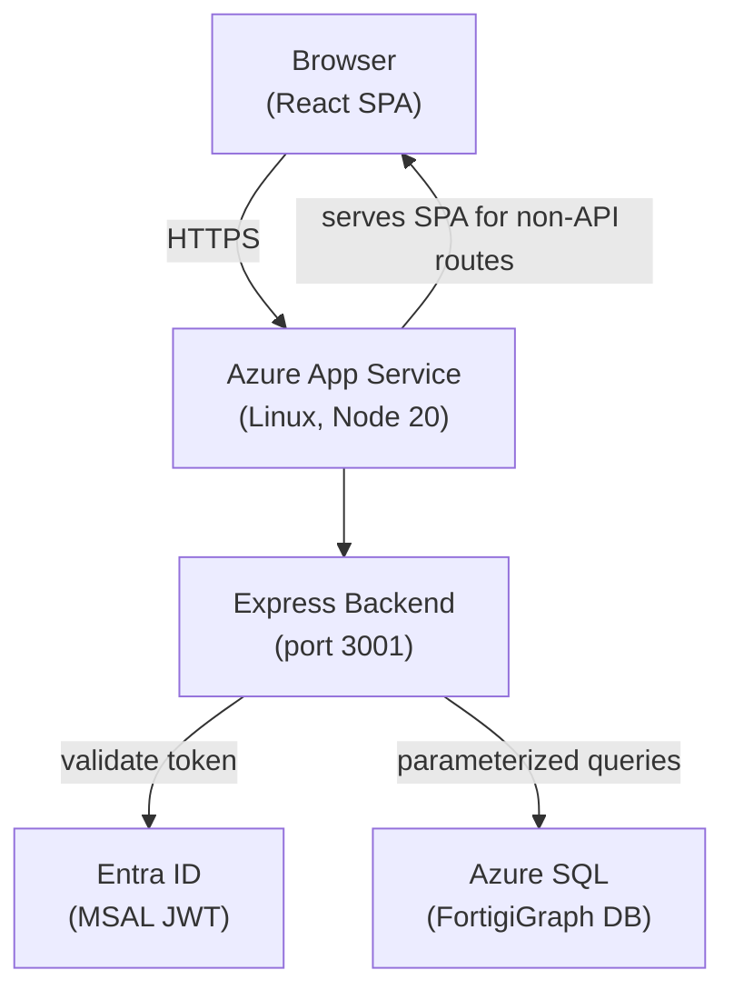

# UI Deployment

## Deployment Commands

```powershell
# First-time deployment — creates App Service, App Registration, deploys code
New-FGUI -ConfigFile '.\Config\mycompany.json'

# Without authentication (for demos or development environments)
New-FGUI -ConfigFile '.\Config\mycompany.json' -NoAuth

# Redeploy after code changes — code only, no resource creation
Update-FGUI -ConfigFile '.\Config\mycompany.json'

# Scale App Service and SQL together
Set-FGUI -ConfigFile '.\Config\mycompany.json' -Scaling Optimum

# Remove the UI and stop billing
Remove-FGUI -ConfigFile '.\Config\mycompany.json'
```

!!! warning "No-auth mode"
    When `-NoAuth` is used, a visible amber warning banner is displayed to all users. Do not use no-auth mode in production environments.

---

## Architecture



| Layer | Technology | Notes |
|-------|-----------|-------|
| Frontend | React + Vite + Tailwind CSS + TanStack Table v8 | SPA, route-based code splitting via `React.lazy`, lazy-loaded Excel export and drag-and-drop |
| Backend | Node.js + Express | REST API on port 3001; serves the compiled SPA for all non-API routes |
| Authentication | Entra ID (MSAL) | v1 + v2 JWT support; optional `-NoAuth` mode |
| Deployment | Azure App Service (Linux, Node 20) | Oryx build-on-deploy; ~4 min build time |
| Data sources | Azure SQL | All FortigiGraph tables and materialized views |

---

## Scaling Options

`Set-FGUI -Scaling <tier>` queries database row counts to determine environment size, then selects matched App Service and SQL tiers.

| Tier | Best For | App Service SKU | SQL SKU |
|------|---------|----------------|---------|
| `Tiny` | < 500 users, demos | F1 (Free) | Basic |
| `Basic` | Small organizations | B1 | Standard S0 |
| `Optimum` | Medium organizations *(recommended default)* | P0v3 | Standard S2 |
| `Fast` | Large organizations, performance-critical | P1v3 | Standard S4 |

!!! tip "Interactive scaling selection"
    `New-FGUI` presents an interactive scaling menu with estimated monthly costs and a recommendation based on detected user count. Pass `-Scaling <tier>` explicitly to skip the menu.

!!! note "Tiny tier"
    `Tiny` is hidden from the interactive menu when it resolves to the same SKUs as `Basic` (small environments). Passing `-Scaling Tiny` explicitly in that case silently uses Basic.

---

## Performance Monitoring

Enable during deployment or redeployment:

```powershell
New-FGUI    -ConfigFile '.\Config\mycompany.json' -PerformanceMetrics
Update-FGUI -ConfigFile '.\Config\mycompany.json' -PerformanceMetrics
```

This sets `PERF_METRICS_ENABLED=true` on the App Service environment. When the flag is not set, there is **zero overhead** — the middleware short-circuits immediately.

When enabled:

- Every API request is timed end-to-end, with per-SQL-query breakdowns
- `Server-Timing` headers are emitted (visible in browser DevTools → Network tab)
- Metrics are stored in a server-side ring buffer (1000 entries, newest overwrites oldest)
- The **Performance** tab in the UI displays P50/P95/P99 per endpoint, recent requests, and slowest requests
- Export the full ring buffer as JSON for offline analysis

To disable without redeploying, remove the `PERF_METRICS_ENABLED` environment variable in the Azure Portal or set it to `false`.

---

## Environment Variables

All variables below are set automatically by `New-FGUI` and `Update-FGUI`. They are listed here for reference and for manual troubleshooting in the Azure Portal.

### Authentication

| Variable | Purpose |
|----------|---------|
| `AUTH_ENABLED` | `true` / `false` — enables or disables Entra ID authentication |
| `AUTH_CLIENT_ID` | App registration client ID used by MSAL |
| `AUTH_TENANT_ID` | Entra ID tenant ID; also used for token tenant validation |
| `AUTH_REQUIRED_ROLES` | Optional — comma-separated app role names required for access |

### CORS

| Variable | Purpose |
|----------|---------|
| `ALLOWED_ORIGINS` | Allowed CORS origins. Defaults to same-origin only in production. Set explicitly if the frontend is served from a different domain. |

### Database

| Variable | Purpose |
|----------|---------|
| `SQL_SERVER` | Azure SQL server FQDN (e.g., `myserver.database.windows.net`) |
| `SQL_DATABASE` | Database name |
| `SQL_USER` | SQL login username |
| `SQL_PASSWORD` | SQL login password |
| `USE_SQL` | `true` / `false` — set to `false` to use built-in mock data (for local development) |

### Features and Monitoring

| Variable | Purpose |
|----------|---------|
| `PERF_METRICS_ENABLED` | `true` / `false` — enable backend performance monitoring |
| `FEATURE_RISK_SCORING` | `true` / `false` — show or hide the Risk Scores tab |
| `FEATURE_ACCOUNT_CORRELATION` | `true` / `false` — show or hide the Identities tab |
| `MODULE_VERSION` | FortigiGraph module version string — displayed in the UI footer |
