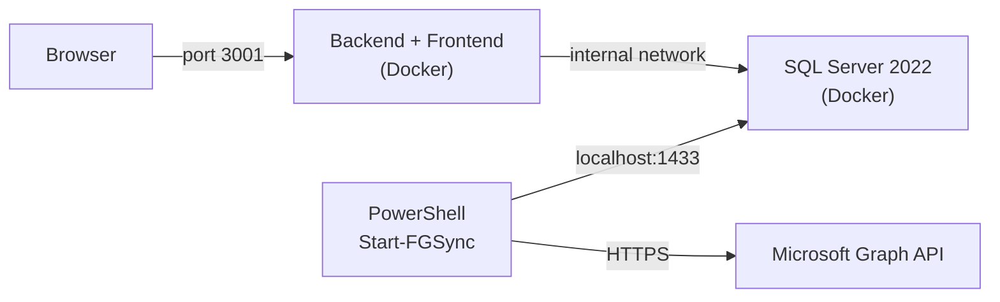

# Local Development with Docker

FortigiGraph includes a Docker Compose setup that runs a complete local stack — SQL Server 2022 + the UI backend (serving the built frontend) — with no Azure subscription required. This is useful for development, testing, and demos.

## Prerequisites

- [Docker Desktop](https://www.docker.com/products/docker-desktop/) (or any Docker Engine + Compose v2)
- PowerShell 7+ (for running the sync script)
- A FortigiGraph config file with valid **Graph API credentials** (Azure SQL fields are not used in local mode)

## Architecture



The SQL Server port `1433` is exposed to the host so the PowerShell sync can connect from outside the Docker network — no need to run PowerShell inside a container.

## Start the Stack

```bash
docker compose -f docker-compose.local.yml up -d
```

This starts:

| Service | What it does |
|---|---|
| `sql` | SQL Server 2022 Developer Edition (persisted in `sql_data` volume) |
| `sql-init` | Creates the `GraphData` database on first start (runs once, then exits) |
| `backend` | Builds frontend + starts Express API; auth disabled by default |

Wait ~30 seconds for SQL Server to be ready, then open **http://localhost:3001**.

The UI will show an empty matrix until you run a sync.

!!! warning "Auth is disabled in local mode"
    `AUTH_ENABLED=false` is set by default in `docker-compose.local.yml`. The amber warning banner will appear in the UI — this is expected.

## Run a Sync

Use the included helper script to sync Entra ID data into the local SQL Server:

```powershell
.\scripts\local-sync.ps1 -ConfigFile .\Config\yourtenant.json
```

This:

1. Loads the FortigiGraph module from the repo root
2. Connects directly to `localhost:1433` (bypasses Azure connection logic)
3. Authenticates to Microsoft Graph using your config file credentials
4. Runs `Start-FGSync` against the local database

!!! note
    The `Azure.*` fields in your config file are not used during local sync. Only `Graph.TenantId`, `Graph.ClientId`, and `Graph.ClientSecret` need to be real values.

### Custom SQL password or database name

```powershell
.\scripts\local-sync.ps1 -ConfigFile .\Config\yourtenant.json `
    -SQLPassword "MyCustomPassword!" `
    -SQLDatabase "MyDatabase"
```

The default password (`FortigiGraph_Local1!`) matches the `docker-compose.local.yml` setting.

## Stopping and Resetting

```bash
# Stop the stack (data persists in the sql_data volume)
docker compose -f docker-compose.local.yml down

# Stop and delete all data (full reset)
docker compose -f docker-compose.local.yml down -v
```

## Building the Image Manually

The `UI/backend/Dockerfile` does a multi-stage build: builds the React frontend in stage 1, then copies the compiled output into the Express backend in stage 2. Both are served by the same Node.js process on port 3001.

```bash
# Build from the UI/ directory (backend Dockerfile expects this context)
docker build -f UI/backend/Dockerfile -t fortigraph-backend ./UI

# Or use the root Dockerfile (same result, different build context)
docker build -t fortigraph-backend .
```

### Frontend-only dev container

For frontend-only development with hot reload:

```bash
docker build -t fortigraph-frontend ./UI/frontend
docker run -p 5173:5173 -v $(pwd)/UI/frontend/src:/app/src fortigraph-frontend
```

This mounts `src/` from your host for live reload while the container watches for changes.

## Environment Variables

Override any setting in `docker-compose.local.yml` by creating a `.env` file in the repo root or setting environment variables before running `docker compose`:

| Variable | Default | Description |
|---|---|---|
| `AUTH_ENABLED` | `false` | Enable/disable Entra ID auth |
| `AUTH_CLIENT_ID` | — | App registration client ID (required if auth enabled) |
| `AUTH_TENANT_ID` | — | Entra ID tenant ID (required if auth enabled) |
| `SQL_TRUST_SERVER_CERT` | `true` | Trust SQL Server's self-signed cert (local only) |
| `SQL_PASSWORD` | `FortigiGraph_Local1!` | SA password |
| `PORT` | `3001` | Backend port |

!!! tip "Enabling auth locally"
    Set `AUTH_ENABLED=true`, `AUTH_CLIENT_ID`, and `AUTH_TENANT_ID` in `docker-compose.local.yml` to test with real Entra ID login. Ensure `http://localhost:3001` is added as a redirect URI in your app registration.
